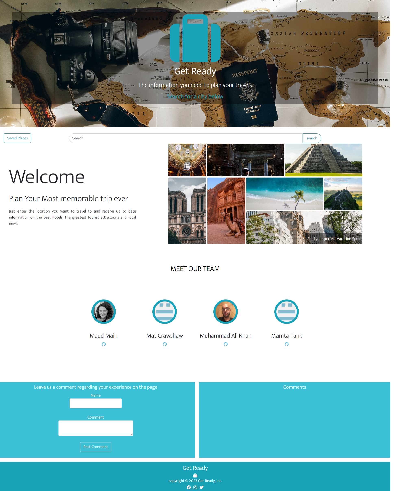

#  Get Ready - Plan your most memorable trip

## Our team
[Muhammad Ali Khan](https://github.com/Maks6831) <br>
[Mat Crawshaw](https://github.com/matcrawshaw) <br>
[Maud Mainnemard](https://github.com/maudmain) <br>

## Project description
Front end webpage that gathers information about a location for a user to help prepare for their travel.

## Table of content
- [Deployed Page](#deployed-page)
- [User Story](#user-story)
- [Motivation for the Project](#motivation-for-the-project)
- [Project criteria](#project-criteria)
- [Process](#process)
- [Get Started](#get-started)
- [Direction for future development](#directions-for-future-development)


## Deployed page
To view the final results, open [Get Ready]() in the browser. 

## User Story
```
As a traveler, 
I want to get information about a place I want to visit including local tourist information, hotels and news articles related to the place,
so that I can be more prepared for my trip.
I want to be able to save my favourite attractions,
so I can find them again.
```

## Motivation for the project
As kean holidayers, we were interested on having one place where we can research and collect information we like about the place we want to visit.<br>
We wanted to have an easy to navigate page that displayed the information with the option to save our favorite attractions to review at a later time if needed. <br>

As developers in training, we wanted to work on strengthening our skills in various area:<br>
Maud: get a better understanding and practice of CSS and Bootstrap. <br>
Muhammad: <br>
Mat: <br>
We all wanted to understand and follow a project workflow (collaboration/ git process (pull requests, merges, resolve conflicts...)).

## Project criteria 
The project had to fulfill the following criteria:
- Use Bootstrap.
- Be deployed to GitHub Pages.
- Be interactive (in other words, accept and respond to user input).
- Use at least two server-side APIs Links to an external site..
- Does not use alerts, confirms, or prompts (use modals).
- Use client-side storage to store persistent data.
- Be responsive.
- Have a polished UI.
- Have a clean repository that meets quality coding standards (file structure, naming conventions, best practices for class/id naming conventions, indentation, quality comments, and so on).
- Have a quality README (including a unique name, description, technologies used, screenshot, and link to the deployed application).

## Process
1. Technologies used<br>
The page was build using HTML, CSS, Bootstrap, JS, and server APIs (OpenTripMap, unsplash, hotels.com, The Guardian).<br><br>
2. Tasks and roles<br>
The process followed those steps:
- Decide on the user story and the wireframing of the page.
- Divide the tasks between us according to what we wanted to work on.
- Organise the GitHub project so we can keep track of our progress.
- Keep up to date with the team via Slack and help others if needed.
- Have a stand up meeting at the beginning of class to set up objectives.
- Finalise the project and presentation.
- Presentation/demo day

3. Challenges & Solutions/ Successes
- Learning how to work in a team and how other people work, understanding other people's code. =>> The team fit quite nicely as we all had different skills, abilities and time constraints.
- Getting familiar with git workflow, setting GitHub, merge conflicts =>> following the resources and advice given by the instructor team, doing it a few times to get more confident with the process.
- Time constraint due to other commitments.
- Limitation or complexity of the APIs <br>
ie: OpenTripMap = hard to work with. <br>
The Guardian = returning past-dated data currently (when set a date was returning very little data)  =>>  Choice of a different API might have been better.<br> 
Booking.com = limitation on query number =>> Created more API keys. <br>
- Features like carousel and favourites needed a lot of work and research =>> Mat and Muhammad happy to conquer those challenges by doing a cracking job :-)
- CSS layout =>> practice those skills for the projects by adding some features to the page .

## Get started
To view the final results, open [Get Ready]() in the browser. <br>
When the user open the page, the landing page will show a welcome message prompting them to enter a city to search for information on the best hotels, the greatest tourist attractions and local news.<br>
There is a Saved Places button to review your favourite attractions in a second HTML page. <br>
There is also a Meet our Team Section where you can access each member' GitHub and a Leave a Comment section. The latest was build on the idea that if the site was tested in person by a team of reviewers, they could leave a comment to let us know about their experience on the page (the latest 3 comments will appear on the page and the rest is stored locally).

[Landing Page Demo](./assets/Get%20Ready-demo.webm)


To start, enter a city in the search box. The welcome section will be replaced by the results and display the information. At the same time, the city will be saved in local storage and a button will be created so you quickly search for the location again.

You will have the opportunity to go through the carousel of attractions,and favourite to add them to your Saved Places. Click on Read more to continue reading.
Click on the buttons for the hotels and news to get to open a new page to the specific information website.

At any point you can click on the Saved Places button to go checkout your favourites. 


## Directions for future development
- Add more sections such as restaurants, weather.
- being able to search for a location (region) and not just a city.
- Find a more suitable news API which will be able to display more up-to-date articles.
- Organise the Saved Places by location
